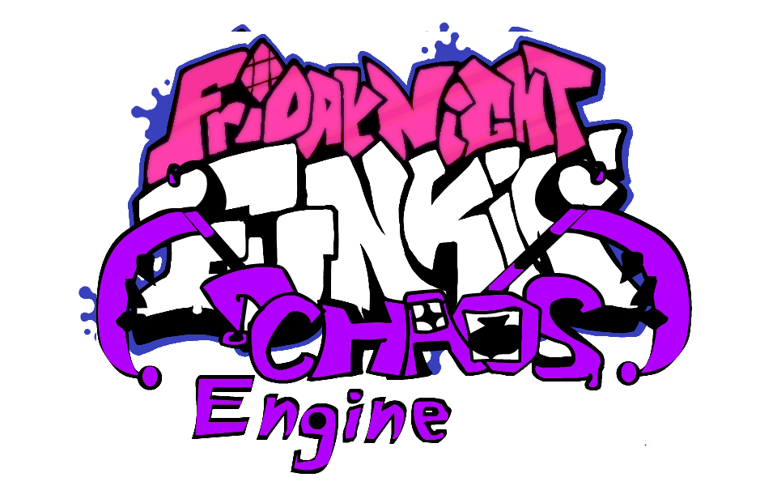



# Features

 - **New Scripting System**
	 - Really Cool HScript Still unFinshied But you can Use it In Songs.
 - **Note Type Selecter**
	 - Its Like Psych Engine NoteType but everything Should be Source and There Example For IT Warnning Note Type.
 - **Middle Scroll**
	 - Make Arrows in a Middle.
 - **Week 7 Here** 

 - **Kade engine 1.5.4 Stuff**	

# Credits
### Friday Night Funkin'
 - [ninjamuffin99](https://twitter.com/ninja_muffin99) - Programming
 - [PhantomArcade3K](https://twitter.com/phantomarcade3k) and [Evilsk8r](https://twitter.com/evilsk8r) - Art
 - [Kawai Sprite](https://twitter.com/kawaisprite) - Music

This game was made with love to Newgrounds and its community. Extra love to Tom Fulp.
### Kade Engine
- [Zead](https://github.com/KadeDev/Kade-Engine/graphs/contributors) - programmer
- [Based Kade Engie 1.5.4](https://twitter.com/KadeDeveloper) - Own Kade engine engine 

### Shoutouts
- [GWebDev](https://github.com/GrowtopiaFli) - Video Code
- [Rozebud](https://github.com/ThatRozebudDude) - Ideas (that I stole)
- [Puyo](https://github.com/daniel11420) - Setting up appveyor and a lot of other help